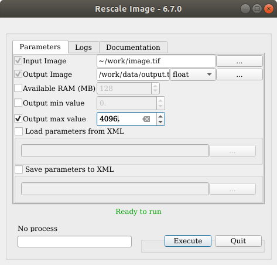

A brief tour of OTB-Applications
================================

Introduction
------------

**OTB Applications** was perhaps the older package of the **Orfeo
Toolbox** suite after the OTB package itself. Since the **Orfeo
Toolbox** is a library providing remote sensing functionalities, the
only applications that were distributed at the beginning were the
examples from the Software Guide and the tests. These applications are
very useful for the developer because their code is very short and only
demonstrates one functionality at a time. In many cases, a real
application would require :

-  combining together two or more functions from the **Orfeo Toolbox**

-  providing a nice high level interface to handle : parameters, input
   data, output data and communication with the user

The **OTB Applications** package was originally designed to provide
applications performing simple remote sensing tasks, more complex than
simple examples from the Software Guide, and with a more user-friendly
interface (either graphical or command-line), to demonstrate the use of
the **Orfeo Toolbox** functions. The most popular applications are maybe
the *otbImageViewerManager* , which allows to open a collection of
images and navigate in them, and the
*otbSupervisedClassificationApplication* , which allowed to delineate
training regions of interest on the image and classify the image with a
SVM classifier trained with these regions (this application is no longer
maintained since the same functionnality is available through the
corresponding **Monteverdi** module). During the first 3 years of the
**Orfeo Toolbox** development, many more applications have been added to
this package, to perform various tasks. Most of them came with a
graphical user interface, apart from some small utilities that are
command-line.

The development and release of the **Monteverdi** software (see
chapter [chap:Monteverdi] at the end of year 2009 changed a lot of
things for the **OTB Applications** package: most of non-developer users
were looking for quite a long time for an application providing **Orfeo
Toolbox** functionalities under a unified graphical interface. Many
applications from the **OTB Applications** package were integrated to
**Monteverdi** as modules, and the **OTB Applications** package lost a
lot of its usefulness. No more applications were added to the package
and it was barely maintained, as new graphical tools were directly
embedded within **Monteverdi** .

Then, some people started to regain interest in the **OTB Applications**
package. **Monteverdi** is a great tool to perform numerous remote
sensing and image processing task in a minute, but it is not well
adapted to heavier (and longer) processing, scripting and batch
processing. Therefore, in 2010 the **OTB Applications** package has been
revamped: old applications have been moved to a legacy folder for
backward compatibility, and the development team started to populate the
package with compact command-line tools to perform various heavy
processing tasks.

Later on in 2011, the **OTB Applications** has been further revamped.
Because of the increasing need to interface the **OTB Applications**
into other software and to provide auto-generated interfaces, the
**Orfeo Toolbox** development team decided to develop a new application
framework. The main idea of this framework is the following: each
application is written once for all in a shared library (also known as
plugin). This plugin can be auto-loaded into appropriate tools wihtout
recompiling, and is able to fully describe its parameters, behaviour and
documentation.

The tools to use the plugins can be extended, but **Orfeo Toolbox**
shipped the following:

-  A command-line laucher, which is almost equivalent to the former
   **OTB Applications** command-line interface,

-  A graphical launcher, with an auto-generated QT interface, providing
   ergonomic parameters setting, display of documentation, and progress
   reporting,

-  A SWIG interface, which means that any application can be loaded
   set-up and executed into a high-level language such as Python or Java
   for instance.

Additionally, `QGis <http://www.qgis.org/>`_  plugins built on top of
the SWIG/Python interface are available with seamless integration within
QGis. You can find a short guide about it
`here <http://wiki.orfeo-toolbox.org/index.php/Quantum_GIS_access_to_OTB_applications>`_ .

To facilitate the use of these tools and applications, they will now be
shipped with the standard **Orfeo Toolbox** package. It means that the
former **OTB-Applications** package has entered its maintenance cycle :
no new feature will be pushed there, and all development is done
directly inside the **Orfeo Toolbox** package.

The **OTB Applications** are now rich of more than 40 tools, which are
listed in the the applications reference documentation, presented in
chapter [chap:apprefdoc], page .

Installation
------------

We provide different standalone binary packages for OTB-Applications:

-  for Windows platform (7 or higher)

-  for 64bit Linux distribution

-  for MacOS X

Other binaries can be available as packages (OSGeo packages,
Debian/Ubuntu packages, OpenSuse packages), however be advised that they
may not be up-to-date nor delivered with full features. If you want to
build from source or if we don’t provide packages for your system, some
informations are available into the , in the section **(**\ Building
from Source)

Windows
~~~~~~~

We provide for Windows Seven and later through standalone packages. They
are cross-compiled with MinGW, for 32bit and 64bit platforms. They
contain all and their launchers (both command line and graphical
launchers are provided). Check the download page : `OTB Download
page <https://www.orfeo-toolbox.org/download>`__

There is a 32bit and a 64bit version. They contain the same directory
structure:

-  ``monteverdi.bat`` : A launcher script for

-  ``mapla.bat`` : A launcher script for Mapla

-  ``otbenv.bat`` : A script to initialize the environment for OTB
   executables

-  ``bin`` : A folder containing application launchers (otbcli.bat,
   otbgui.bat) and the DLLs.

-  ``lib`` : A folder containing application DLLs.

The applications can be launched from the Mapla launcher. If you want to
use the otbcli and otbgui launchers, you can initialize a command prompt
with ``otbenv.bat``.

Linux 64bit
~~~~~~~~~~~

We provide for Linux 64bit OS through standalone packages. They contain
all OTB Applications and their launchers (both command line and
graphical launchers are provided). Check the download page : `OTB
Download page <https://www.orfeo-toolbox.org/download>`__

This package is a self-extractible archive. You may uncompress it with a
double-click on the file, or with the command line :

::

    > chmod +x OTB-&\otbversion&-Linux64.run
    > ./OTB-&\otbversion&-Linux64.run

Please note that the resulting installation is not meant to be moved,
you should uncompress the archive in its final location. Once the
archive is extracted, the directory structure is made of :

-  ``monteverdi.sh`` : A launcher script for

-  ``mapla.sh`` : A launcher script for Mapla

-  ``otbenv.profile`` : A script to initialize the environment for OTB
   executables

-  ``bin`` : A folder containing application launchers (otbcli.sh,
   otbgui.sh), Monteverdi and Mapla.

-  ``lib`` : A folder containing all shared libraries and OTB
   applications.

-  ``share`` : A folder containing common resources and copyright
   mentions.

In order to run the command line launchers, this package doesn’t require
any special library that is not present in most modern Linux
distributions. The graphical executable (otbgui launchers, Monteverdi
and Mapla) use the X11 libraries, which are widely used in a lot of
distributions :

::

    libx11-6 libxext6 libxau6 libxxf86vm1 libxdmcp6 libdrm2

Monteverdi also requires the standard graphics libraries **libgl1** and
**libglu1**. Make sure you have at least one version of them installed
in your system.

The applications can be launched from the Mapla launcher. If you want to
use the otbcli and otbgui launchers, you can initialize your environment
with ``source otbenv.profile``.

MacOS X
~~~~~~~

We provide for MacOS X through a standalone package. This package is a
self-extractible archive, quite similar to the Linux one. You may
uncompress it with the command line :

::

    > chmod +x  OTB-&\otbversion&-Darwin64.run
    > ./OTB-&\otbversion&-Darwin64.run

Once the archive is extracted, you can see OTB--Darwin64 directory in
the same direcrtory along with OTB--Darwin64.run

Contents of OTB--Darwin64 is briefly listed below:

-  ``Monteverdi.app`` : A Mac OSX .app for Monteverdi

-  ``Mapla.app`` : A Mac OSX .app for Mapla.

-  ``bin`` : A folder containing application launchers (otbcli.sh,
   otbgui.sh), monteverdi and mapla binaries.

-  ``lib`` : A folder containing all shared libraries and OTB
   applications.

-  ``share`` : A folder containing common resources and copyright
   mentions.

Notes:

-  If you want to use the otbcli and otbgui launchers, you must access
   them via a terminal prompt.

-  The OSX .app are provided for monteverdi (viewer) and mapla
   (application browser).

-  You must use monteverdi and mapla through their .app files only.

-  You are allowed to move these .app files and refrain from moving or
   deleting OTB--Darwin64 after extraction. In case you need to have OTB
   installed in some other directory. Extract the .run file there.

Other packages
~~~~~~~~~~~~~~

**Warning !** These packages may not be up-to-date with latest OTB
releases. In addition, some features of the library may not be available
on every platform. Some of these are not maintained by OTB-team. If you
want to get involved in the packaging of OTB for your favourite
platform, please contact us through the developer’s mailing list :
otb-developers@googlegroups.com.

Debian
^^^^^^

There are OTB packages for Debian (unstable) since version 5.2.0. OTB
Applications packages may be available as Debian packages through APT
repositories:

-  **otb-bin** for command line applications

-  **otb-bin-qt** for Qt applications

-  **python-otb** for python applications

Due to license issues, the OTB package built in Debian doesn’t contain
6S. As a consequence, the package does not contain the
OpticalCalibration application.

Ubuntu 12.04 and higher
^^^^^^^^^^^^^^^^^^^^^^^

For Ubuntu 12.04 and higher, OTB Applications packages may be available
as Debian packages through APT repositories:

-  **otb-bin** for command line applications

-  **otb-bin-qt** for Qt applications

-  **python-otb** for python applications

Since release 3.14.1, OTB Applications packages are available in the
`ubuntugis-unstable <https://launchpad.net/~ubuntugis/+archive/ubuntugis-unstable>`__
repository.

Since release 5.2.0, the Ubuntu packages derive from the Debian
packages.

You can add it by using these command-lines:

::

    sudo aptitude install add-apt-repository
    sudo apt-add-repository ppa:ubuntugis/ubuntugis-unstable

After you can run:

::

    sudo aptitude install otb-bin otb-bin-qt python-otb

If you are using *Synaptic*, you can add the repositories, update and
install the packages through the graphical interface.

For further informations about Ubuntu packages go to
`ubuntugis-unstable <https://launchpad.net/~ubuntugis/+archive/ubuntugis-unstable>`__
launchpad page and click on **Read about installing**.

**apt-add-repository** will try to retrieve the GPG keys of the
repositories to certify the origin of the packages. If you are behind a
http proxy, this step won’t work and apt-add-repository will stall and
eventually quit. You can temporarily ignore this error and proceed with
the update step. Following this, aptitude update will issue a warning
about a signature problem. This warning won’t prevent you from
installing the packages.

OpenSuse 12.X and higher
^^^^^^^^^^^^^^^^^^^^^^^^

For OpenSuse 12.X and higher, OTB Applications packages are available
through *zypper*.

First, you need to add the appropriate repositories with these
command-lines (please replace :math:`11.4` by your OpenSuse version):

::

    sudo zypper ar
    http://download.opensuse.org/repositories/games/openSUSE_11.4/ Games
    sudo zypper ar
    http://download.opensuse.org/repositories/Application:/Geo/openSUSE_11.4/ GEO
    sudo zypper ar
    http://download.opensuse.org/repositories/home:/tzotsos/openSUSE_11.4/ tzotsos

Now run:

::

    sudo zypper refresh
    sudo zypper install OrfeoToolbox
    sudo zypper install OrfeoToolbox-python

Alternatively you can use the One-Click Installer from the `openSUSE
Download
page <http://software.opensuse.org/search?q=Orfeo&baseproject=openSUSE%3A11.4&lang=en&include_home=true&exclude_debug=true>`__
or add the above repositories and install through Yast Package
Management.

There is also support for the recently introduced ’rolling’ openSUSE
distribution named ’Tumbleweed’. For Tumbleweed you need to add the
following repositories with these command-lines:

::

    sudo zypper ar
    http://download.opensuse.org/repositories/games/openSUSE_Tumbleweed/ Games
    sudo zypper ar
    http://download.opensuse.org/repositories/Application:/Geo/openSUSE_Tumbleweed/ GEO
    sudo zypper ar
    http://download.opensuse.org/repositories/home:/tzotsos/openSUSE_Tumbleweed/ tzotsos

and then add the OTB packages as shown above.

MacPort
^^^^^^^

OTB Applications are now available on
`MacPorts <http://http://www.macports.org/>`__. The port name is called
’orfeotoolbox’. You can follow the `MacPorts
documentation < http://guide.macports.org/>`__ to install MacPorts
first, then install the ’orfeotoolbox’ port. After the installation, you
can used directly on your system, the OTB applications.

Using the applications
----------------------

Using the new framework is slightly more complex than launching a
command-line tool. This section describes all the ways to launch the new
applications. Apart from the simplified access, which is similar to the
former access to , you will need to know the application name and
optionally the path where the applications plugins are stored. For
applications shipped with , the name of each application can be found in
chapter [chap:apprefdoc], page .

Simplified use
~~~~~~~~~~~~~~

All standard applications delivered in with comes with simplified
scripts in the system path, allowing to launch the command-line and
graphical user interface versions of the application in the same simple
way we used to launch the old applications. The command-line interface
is prefixed by ``otbcli_``, while the Qt interface is prefixed by
``otbgui_``. For instance, calling ``otbcli_Convert`` will launch the
command-line interface of the **Convert** application, while
``otbgui_Convert`` will launch its GUI.

Passing arguments to the command-line version (prefixed by ``otbcli_``)
is explained in next sub-section.

Using the command-line launcher
~~~~~~~~~~~~~~~~~~~~~~~~~~~~~~~

The command-line application launcher allows to load an application
plugin, to set its parameters, and execute it using the command line.
Launching the ``otbApplicationLauncherCommandLine`` without argument
results in the following help to be displayed:

::

    $ otbApplicationLauncherCommandLine
    Usage : ./otbApplicationLauncherCommandLine module_name [MODULEPATH] [arguments]

The ``module_name`` parameter corresponds to the application name. The
``[MODULEPATH]`` argument is optional and allows to pass to the launcher
a path where the shared library (or plugin) corresponding to
``module_name`` is.

It is also possible to set this path with the environment variable
``OTB_APPLICATION_PATH``, making the ``[MODULEPATH]`` optional. This
variable is checked by default when no ``[MODULEPATH]`` argument is
given. When using multiple paths in ``OTB_APPLICATION_PATH``, one must
make sure to use the standard path separator of the target system, which
is ``:`` on Unix, and ``;`` on Windows.

An error in the application name (i.e. in parameter ``module_name``)
will make the ``otbApplicationLauncherCommandLine`` lists the name of
all applications found in the available path (either ``[MODULEPATH]``
and/or ``OTB_APPLICATION_PATH``).

To ease the use of the applications, and try avoiding extensive
environment customization, ready-to-use scripts are provided by the OTB
installation to launch each application, and takes care of adding the
standard application installation path to the ``OTB_APPLICATION_PATH``
environment variable.

These scripts are named ``otbcli_<ApplicationName>`` and do not need any
path settings. For example you can start the Orthorectification
application with the script called ``otbcli_Orthorectification``.

Launching an application with no or incomplete parameters will make the
launcher display a summary of the parameters, indicating the mandatory
parameters missing to allow for application execution. Here is an
example with the **OrthoRectification** application:

::

    $ otbcli_OrthoRectification

    ERROR: Waiting for at least one parameter...

    ====================== HELP CONTEXT ======================
    NAME: OrthoRectification
    DESCRIPTION: This application allows to ortho-rectify optical images from supported sensors.

    EXAMPLE OF USE:
    otbcli_OrthoRectification -io.in QB_TOULOUSE_MUL_Extract_500_500.tif -io.out QB_Toulouse_ortho.tif

    DOCUMENTATION: http://www.orfeo-toolbox.org/Applications/OrthoRectification.html
    ======================= PARAMETERS =======================
            -progress                        <boolean>        Report progress
    MISSING -io.in                           <string>         Input Image
    MISSING -io.out                          <string> [pixel] Output Image  [pixel=uint8/int8/uint16/int16/uint32/int32/float/double]
            -map                             <string>         Output Map Projection [utm/lambert2/lambert93/transmercator/wgs/epsg]
    MISSING -map.utm.zone                    <int32>          Zone number
            -map.utm.northhem                <boolean>        Northern Hemisphere
            -map.transmercator.falseeasting  <float>          False easting
            -map.transmercator.falsenorthing <float>          False northing
            -map.transmercator.scale         <float>          Scale factor
            -map.epsg.code                   <int32>          EPSG Code
            -outputs.mode                    <string>         Parameters estimation modes [auto/autosize/autospacing]
    MISSING -outputs.ulx                     <float>          Upper Left X
    MISSING -outputs.uly                     <float>          Upper Left Y
    MISSING -outputs.sizex                   <int32>          Size X
    MISSING -outputs.sizey                   <int32>          Size Y
    MISSING -outputs.spacingx                <float>          Pixel Size X
    MISSING -outputs.spacingy                <float>          Pixel Size Y
            -outputs.isotropic               <boolean>        Force isotropic spacing by default
            -elev.dem                        <string>         DEM directory
            -elev.geoid                      <string>         Geoid File
            -elev.default                    <float>          Average Elevation
            -interpolator                    <string>         Interpolation [nn/linear/bco]
            -interpolator.bco.radius         <int32>          Radius for bicubic interpolation
            -opt.rpc                         <int32>          RPC modeling (points per axis)
            -opt.ram                         <int32>          Available memory for processing (in MB)
            -opt.gridspacing                 <float>          Resampling grid spacing

For a detailed description of the application behaviour and parameters,
please check the application reference documentation presented
chapter [chap:apprefdoc], page  or follow the ``DOCUMENTATION``
hyperlink provided in ``otbApplicationLauncherCommandLine`` output.
Parameters are passed to the application using the parameter key (which
might include one or several ``.`` character), prefixed by a ``-``.
Command-line examples are provided in chapter [chap:apprefdoc], page .

Using the GUI launcher
~~~~~~~~~~~~~~~~~~~~~~

The graphical interface for the applications provides a usefull
interactive user interface to set the parameters, choose files, and
monitor the execution progress.

This interface can be activated through the CMake option .

This launcher needs the same two arguments as the command line launcher
:

::

    $ otbApplicationLauncherQt module_name [MODULEPATH]

The application paths can be set with the ``OTB_APPLICATION_PATH``
environment variable, as for the command line launcher. Also, as for the
command-line application, a more simple script is generated and
installed by OTB to ease the configuration of the module path : to
launch the graphical user interface, one will start the
``otbgui_Rescale`` script.

The resulting graphical application displays a window with several tabs:

-  **Parameters** is where you set the parameters and execute the
   application.

-  **Logs** is where you see the informations given by the application
   during its execution.

-  **Progress** is where you see a progress bar of the execution (not
   available for all applications).

-  **Documentation** is where you find a summary of the application
   documentation.

In this interface, every optional parameter has a check box that you
have to tick if you want to set a value and use this parameter. The
mandatory parameters cannot be unchecked.

The interface of the application is shown here as an example.

|image| [fig:rescaleParam]

|image| [fig:rescaleLogs]

|image| [fig:rescaleProgress]

|image| [fig:rescaleDocumentation]

Using the Python interface
~~~~~~~~~~~~~~~~~~~~~~~~~~

The applications can also be accessed from Python, through a module
named ``otbApplication``

On Unix systems it is typically available in the ``/usr/lib/otb/python``
directory. You may need to configure the environment variable
``PYTHONPATH`` to include this directory so that the module becomes
available from an Python shell.

On Windows, you can install the ``otb-python`` package, and the module
will be available from an OSGeo4W shell automatically.

In this module, two main classes can be manipulated :

-  ``Registry``, which provides access to the list of available
   applications, and can create applications

-  ``Application``, the base class for all applications. This allows to
   interact with an application instance created by the ``Registry``

As for the command line and GUI launchers, the path to the application
modules needs to be properly set with the ``OTB_APPLICATION_PATH``
environment variable. The standard location on Unix systems is
``/usr/lib/otb/applications``. On Windows, the applications are
available in the ``otb-bin`` OSGeo4W package, and the environment is
configured automatically so you don’t need to tweak
``OTB_APPLICATION_PATH``.

Here is one example of how to use Python to run the ``Smoothing``
application, changing the algorithm at each iteration.

::

    #  Example on the use of the Smoothing application
    #

    # We will use sys.argv to retrieve arguments from the command line.
    # Here, the script will accept an image file as first argument,
    # and the basename of the output files, without extension.
    from sys import argv

    # The python module providing access to OTB applications is otbApplication
    import otbApplication

    # otbApplication.Registry can tell you what application are available
    print "Available applications : "
    print str( otbApplication.Registry.GetAvailableApplications() )

    # Let's create the application with codename "Smoothing"
    app = otbApplication.Registry.CreateApplication("Smoothing")

    # We print the keys of all its parameter
    print app.GetParametersKeys()

    # First, we set the input image filename
    app.SetParameterString("in", argv[1])

    # The smoothing algorithm can be set with the "type" parameter key
    # and can take 3 values : 'mean', 'gaussian', 'anidif'
    for type in ['mean', 'gaussian', 'anidif']:

      print 'Running with ' + type + ' smoothing type'

      # Here we configure the smoothing algorithm
      app.SetParameterString("type", type)

      # Set the output filename, using the algorithm to differenciate the outputs
      app.SetParameterString("out", argv[2] + type + ".tif")

      # This will execute the application and save the output file
      app.ExecuteAndWriteOutput()

Load/Save OTB-Applications parameters from/to file
~~~~~~~~~~~~~~~~~~~~~~~~~~~~~~~~~~~~~~~~~~~~~~~~~~

Since OTB 3.20, OTB applications parameters can be export/import to/from
an XML file using inxml/outxml parameters. Those parameters are
available in all applications.

An example is worth a thousand words

::

    otbcli_BandMath -il input_image_1 input_image_2
                    -exp "abs(im1b1 - im2b1)"
                    -out output_image
                    -outxml saved_applications_parameters.xml

Then, you can run the applications with the same parameters using the
output xml file previously saved. For this, you have to use the inxml
parameter:

::

    otbcli_BandMath -inxml saved_applications_parameters.xml

Note that you can also overload parameters from command line at the same
time

::

    otbcli_BandMath -inxml saved_applications_parameters.xml
                    -exp "(im1b1 - im2b1)"

In this cas it will use as mathematical expression “(im1b1 - im2b1)”
instead of “abs(im1b1 - im2b1)”.

Finally, you can also launch applications directly from the command-line
launcher executable using the inxml parameter without having to declare
the application name. Use in this case:

::

    otbApplicationLauncherCommandLine -inxml saved_applications_parameters.xml

It will retrieve the application name and related parameters from the
input xml file and launch in this case the BandMath applications.

Using OTB from QGIS
~~~~~~~~~~~~~~~~~~~

The processing toolbox
^^^^^^^^^^^^^^^^^^^^^^

OTB applications are available from QGIS. Use them from the processing
toolbox, which is accessible with Processing :math:`\rightarrow`
Toolbox. Switch to “advanced interface” in the bottom of the application
widget and OTB applications will be there.

|image| [fig:otb-qgis]

Using a custom OTB
^^^^^^^^^^^^^^^^^^

If QGIS cannot find OTB, the “applications folder” and “binaries folder”
can be set from the settings in the Processing :math:`\rightarrow`
Settings :math:`\rightarrow` “service provider”.

|image| [fig:otb-qgis-settings]

On some versions of QGIS, if an existing OTB installation is found, the
textfield settings will not be shown. To use a custom OTB instead of the
existing one, you will need to replace the otbcli, otbgui and library
files in QGIS installation directly.

.. |image| image:: ../Art/QtImages/rescale_logs.png
.. |image| image:: ../Art/QtImages/rescale_progress.png
.. |image| image:: ../Art/QtImages/rescale_documentation.png
.. |image| image:: ../Art/QtImages/qgis-otb.png
.. |image| image:: ../Art/QtImages/qgis-otb-settings.png
